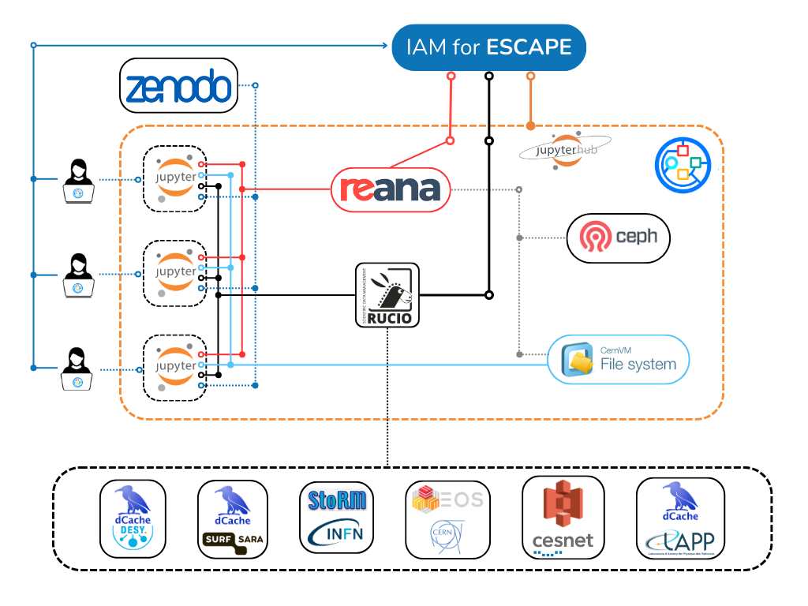

# VRE @ CERN

  
*Designed with [freelogodesign](https://www.freelogodesign.org/)*

The Virtual Research Environment developed at CERN.

VRE links: 
 - VRE platform: https://jhub-vre.cern.ch/ 
 - Code: https://github.com/vre-hub/vre/ 
 - User documentation: https://vre-hub.github.io/ 
 - Technical documentation: https://github.com/vre-hub/vre/wiki
 - VRE file transfer monitoring: https://monit-grafana-open.cern.ch/d/PJ65OqBVz/vre-rucio-events?orgId=16
 - Live status of the VRE services: https://vre-hub.github.io/status/ 
 - VRE Slack channel: [invitation link](https://join.slack.com/t/eosc-escape/shared_invite/zt-1zd76ivit-Z2A2nszN0qfn4VF6Uk6UrQ).

  

## IT Architecture of the VRE

## How to cite us

To cite us, please use the latest publication:

 - The Virtual Research Environment: towards a comprehensive analysis platform - [arXiv link](https://arxiv.org/abs/2305.10166).

## Contact 

Email the CERN VRE team: `escape-cern-ops'at'cern.ch`