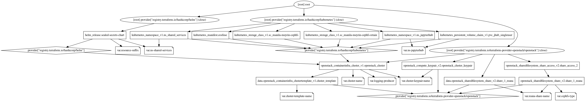

# Terraform Infrastructure

The OpenStack infrastructure is managed by Terraform. The Terraform configuration is split into multiple files and explained in the below graph.

`terraform graph -type=plan | dot -Tpng > graph.png` was used to generate the graph.
